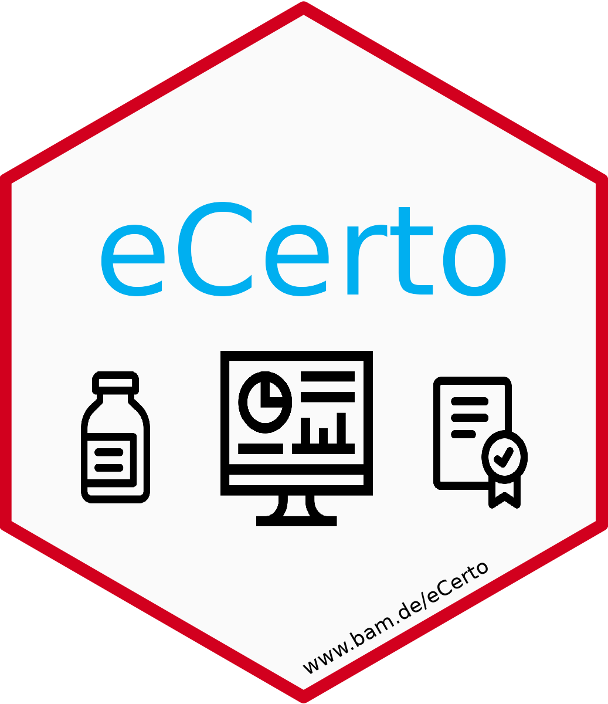

# eCerto

<!-- badges: start -->
[](https://CRAN.R-project.org/package=eCerto)
[](https://github.com/janlisec/eCerto/actions/workflows/R-CMD-check.yaml)
[](https://github.com/janlisec/eCerto/actions/workflows/test-coverage.yaml)
[](https://app.codecov.io/gh/janlisec/eCerto?branch=main)
[](https://github.com/janlisec/eCerto)
[](https://doi.org/10.1007/s00216-023-05099-3)
<!-- badges: end -->



**eCerto** is an R-package providing functions to perform statistical tests
required during the production of a certified reference material.

The production of certified reference materials (CRMs) is a core task of 
the Bundesanstalt für Materialforschung und -prüfung (BAM). Various statistical 
tests are required and applied depending on the task and recorded data to ensure 
that reported values of CRMs are appropriate. Many of them are calculated 
according to the procedures described in `ISO GUIDE 35:2017`. 

The **eCerto** package contains a `Shiny`-App which provides functionality to 
load, process, report and backup data for the statistical evaluation of analyses 
conducted during CRM production.

The app also allows to perform long term stability monitoring (or post 
certification monitoring) to ensure the CRM values remain within specification.

Another app module allows to perform statistical tests for analytical method 
validation, computing the working range and linearity of a method.

## Installation

To run **eCerto** *locally* you can install the package from 
[CRAN](https://cran.r-project.org/package=CorMID) 
or the development version from [GitHub](https://github.com/janlisec/eCerto) and 
start the app with:

``` r
# CRAN
install.packages("eCerto")

# GitHub (alternative for the latest version)
install.packages("devtools")
devtools::install_github("janlisec/eCerto")

# start the app
eCerto::run_app()
```

Apart from `run_app()`, the **eCerto** package currently provides only some 
example data sets and few exported functions. Before installation you can test 
the app version hosted at 
[BAM](https://apps.bam.de/shn00/eCerto/ "www.bam.de/eCerto") using your own 
or the provided example data.

## Detailed documentation

A description of **eCerto** showing a re-evaluation of previously published CRM data 
can be found in this [scientific article](https://doi.org/10.1007/s00216-023-05099-3).
Most of the functionality is also described in the online help.


This is a list of the implemented statistical tests and functionality:

- Homogeneity
    - mean, standard deviation, n
    - ANOVA P-value (bonferroni adjusted)
    - uncertainty contribution
    - boxplot of specimen
    - z-scores over all analytes and specimen
    - downloadable HTML report
- Stability
    - linear model parameters, their errors and significance
    - uncertainty contribution for specified shelf life
    - annotated graphical representations of the linear models and their uncertainties
    - Arrhenius calculations to evaluate stability using different temperature levels
    - downloadable HTML report
- Certification (Inter Laboratory Comparison Study)
    - testing outliers for mean and variance of labs (Scheffe, Dixon, single/double Grubbs, Cochran)
    - testing the lab mean distribution (Bartlett, ANOVA/KS, Skewness/Agostino, Kurtosis/Anscombe)
    - sequential filtering of outliers possible
    - uncertainty contribution of ILC study and combined uncertainty (relative and absolute)
    - annotated graphical representation of analyte data 
    - downloadable HTML report per analyte or for the CRM
- Long Term Stability
    - simple post certification testing as an option
    - long term monitoring with sequential updating of remaining shelf life
    - downloadable PDF report/certificate
- Method Validation
    - working range
    - linear model parameters and statistical evaluation of the residuals (Mandel, Neumann, KS)
    - residual comparison against quadratic models
    - LOD/LOQ
    - Trueness, Precision, Measurement uncertainty as statement boxes for reference
    - downloadable HTML/Word report
    

