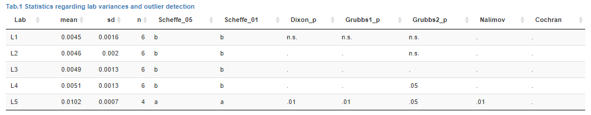

### Laboratory statistics to identify potentially outliers for lab means and lab variances

For the selected analyte various statistical tests regarding lab means and variance will be performed according to ISO 17025 and outlying values will be indicated if observed at the **.05** and **.01** level respectively. `n.s.` and `.` indicate that the test probability was $>0.05$ or this lab was not tested.

Except for `Cochran`, which tests for outliers with respect to variance, all other columns indicate potential outliers regarding lab means.

Most tests require at least 3 data points (Labs) and differences in Lab means and Lab variance. If these conditions are not fulfilled `Error` might be reported instead of a P-value.

*eCerto* uses functions available for the statistical software environment R. Details regarding the conducted statistical test (implementation, parameters) can be found using the following links:
  
* [Scheffe](https://rdrr.io/cran/agricolae/man/scheffe.test.html){target="_blank"} ***Note!*** Similar letters indicate similar group and hence no difference.
* [Dixon](https://rdrr.io/cran/outliers/man/dixon.test.html){target="_blank"}
* [Grubbs](https://rdrr.io/cran/outliers/man/grubbs.test.html){target="_blank"} ***Note!*** Test is performed as single (only most extreme value is tested) as well as double version (two most extreme values are tested against the rest).
* [Nalimov](http://www.statistics4u.info/fundstat_germ/ee_nalimov_outliertest.html){target="_blank"}
* [Cochran](https://rdrr.io/cran/outliers/man/cochran.test.html){target="_blank"} ***Note!*** Test is performed consecutively, i.e. the Lab showing the highest variance is tested first. If significant, it is removed and the procedure is repeated. `excl` indicates that the `sd` of a lab was too low and the lab was removed from the testing procedure.