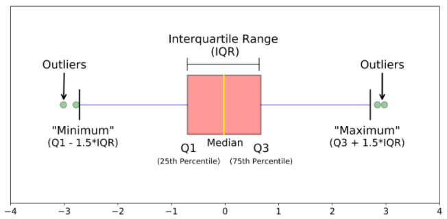

### Homogeneity boxplot

Statistical differences between groups are nicely visualized using boxplots. While the ANOVA allows to calculate a probability testing the hypothesis that the mean values of different groups is similar or not, the boxplot visualizes the distribution of values within each group.

The box comprises 50% of the measured values of a group (from 25% to 75% quartile) and highlights the median (50% quartile). Overlapping boxes indicate that a t-test would not yield a significant p-value.