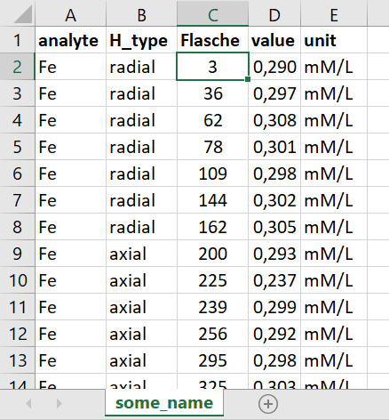

### Homogeneity Data Upload (Excel)

Please prepare all data in a single Excel file on the first table (other tables will be neglected). Please stick to the header/format as given in the below example. The `analyte` column should contain values that match the corresponding data from the certification module. `H_type` can be used to define different homogeneity traits for each analyte which can yield independent uncertainty contributions. `Flasche` encodes the different samples where repeated measurements have been performed on. `value`/ `unit` have to be determined similarly to the data from the certification trial obviously to yield a meaningful uncertainty value.

