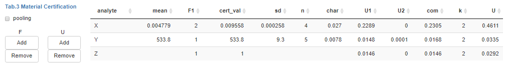
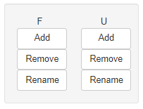

## Material table

The material table combines all data collected within a certification trial to provide for each measured entity within the certified material the certified mean `cert_val` and the certified uncertainty `U`.

***Note!*** Only for analytes which have been visually inspected by the user certified values will be transfered to this table to ensure that inspection took place.

Several columns of the material table can be edited by the user by clicking in an individual cell and entering a new value.

Table column descriptions:

-   `char` describes the *char*acteristic uncertainty
-   `mean` and `sd` give the arithmetric mean and standard deviation for this analyte (dependent on `pooling`)
-   `n` describes the amount of values used for calculting arithmetic average. Example: We have an arbitrary analyte measured in three laboratories with five replicas each. We can calculate `cert_mean` from all three laboratory averages (`n=3`). If a laboratory was filtered, it will be grayed-out in the plot but not considered for `cert_mean` (`n=2`). If the user decides to allow `pooling` `n` will relect the number of finite measurement values from all labs for this analyte.
-   `F` columns can be added and will be used to modify `mean` by multiplication ($mean*F$) yielding `cert_val`
-   `U` columns can be added and may contain relative uncertainty contributions (e.g. from homogeneity or stability modules)
-   `com` describes the *com*bined uncertainty from all U columns: $\sqrt{sum(x ^ 2)}$
-   `k` is an additional expansion factor for the uncertainty $U=com*k$
-   `U_abs` specifies the absolute uncertainty and is calculated by $U_{abs}=U*cert_mean"$

The material table can be exported together with a report as PDF, Word or HTML document.

F and U columns can be added, removed or renamed using the respective parameter panel.

***Note!*** Numeric values are rounded to the number of digits specified by the user at the analyte selection panel (top).
