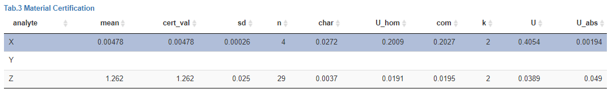

## Material table

The material table combines all data collected within a certification trial to provide for each measured entity within the certified material the certified mean `cert_val` and the certified uncertainty `U`.

***Note!*** Only for analytes which have been visually inspected by the user certified values will be transfered to this table to ensure that inspection took place.

Several columns of the material table can be edited by the user by clicking in an individual cell and entering a new value.

***Note!*** `pooling` means that calculations in the material table (`mean`, `sd` and uncertainty columns) are not based on the lab means, but rather on all measured values. This is justified when the between lab variance is **ToDo**. Selecting this option will also affect `n` being either the number of labs or the number of finite data points.

Table column descriptions:

-   `char` describes the *char*acteristic uncertainty
-   `mean` and `sd` give the arithmetric mean and standard deviation for this analyte (dependent on `pooling`)
-   `n` describes the amount of values used for calculting arithmetic average. Example: We have an arbitrary Analyte measured in three laboratories with five replicas each. We can calculate `cert_mean` from all three laboratory averages (`n=3`). If a laboratory was filtered, it will be grayed-out in the plot but not considered for `cert_mean` (`n=2`).
-   `F` columns can be added and will be used to modify `mean` by multiplication ($mean*F$) yielding `cert_val`
-   `U` columns can be added and may contain relative uncertainty contributions (e.g. from homogeneity or stability modules)
-   `com` describes the *com*bined uncertainty from all U columns: $\sqrt{sum(x ^ 2)}$
-   `k` is another expansion factor for the uncertainty $U=com*k$

The material table can be exported together with a report as PDF, Word or HTML document.

***Note!*** Numeric values are rounded to the number of digits specified by the user in **ToDo**.
