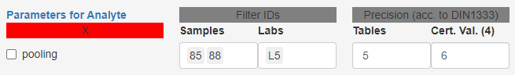

### Analyte options

For analytes under inspection (*i.e.* which are selected in **Tab.C3**), several analyte specific
parameters can be set and will be stored also in the backup file.

#### Pooling

`pooling` means that calculations in the material table (`mean`, `sd` and uncertainty columns) are 
not based on the lab means, but rather on *all* measured values. This is justified when the between lab 
variance is smaller than the within lab variance (check if the ANOVA P-value is insignificant in **Tab.C2**,
if so pooling might be allowed). 

Selecting this option will also affect `n` in **Tab.C3** being either the number of included labs or the 
number of finite data points from these labs.

#### Filtering

Individual **Samples** can be filtered by ID (select `show IDs` in **Fig.C1** to identify outlying IDs). 
These samples will not be used in *any* calculations. They are removed from downstream processing 
right after import. However, information of this filtering step is preserved and included in reports.

**Labs** can be excluded by Lab-ID. Please note, that this is done *after* statistical testing for 
mean and variance outliers (in **Tab.C1** and **Tab.C2**). Filtered labs are depicted in **Fig.C1** 
(using grey color), but excluded from calculating the certified value of the analyte in **Tab.C3**.

#### Rounding

***Note!***
Internally, *all calculations are performed on non-rounded values* (as imported). Only the visual output to
the user is rounded to improve readability. Because analytes within an RM might be measured at very 
different scales it is possible to define analyte specific precision values for rounding. 
The `Precision (Tables)` value is used for most values displayed in tables. 

The only exception is **Tab.C3**. Here, `Precision (µ_c)` is used to round $\mu_c$ and $U_{abs}$ to 
allow to comply with DIN/ISO regulations on rounding and columns containing relative uncertainties
are rounded to fixed 4 digit precision.

The user can decide the rounding precision for $\mu_c$ and $U_{abs}$ and even specify negative numbers 
for `Precision (µ_c)` to indicate a desired rounding digit left of the decimal separator (*i.e.* $-1$ to 
round an uncertainty of 13.1 up to 20). If the uncertainty is even larger, the user should consider to 
upload data using a different (more appropriate) unit and, for instance, switch from mg/L to g/L.

#### DIN1333

*eCerto* suggests the rounding precision for $\mu_c$ and $U_{abs}$ according to DIN 1333. The appropriate
value is displayed right over the input box of `Precision (µ_c)`. It's background is colored 
green if it is in accordance with the user selected value 
and red otherwise.

The significant digit is determined based on the first non-zero digit in $U_{abs}$. The position will be
shown above the analyte parameter `Precision (µ_c)` upon selection of an analyte in **Tab.C3**. Once found, 
the respective digit will be rounded up for $\mu_c$ if the consecutive digit is $\ge 5$ and down otherwise.
For $U_{abs}$ the rounding procedure is a bit more complicated. If the respective digit is 1 or 2, than the 
consecutive digit will be rounded up. If the respective digit is $\ge 3$, than it will be rounded up itself.

