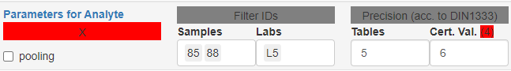

### Analyte Options

For analytes under inspection (i.e. which are selected in **Tab.3**), several analyte specific
parameters can be set. 

Samples can be filtered by ID (select `show IDs` in **Fig.1** to identify outlier IDs). 
These samples will not be used in *any* calculations. They are removed from downstream processing 
right after import. However, information of this filtering step is preserved and included in reports.

Labs can be excluded by Lab-ID. Please note, that this is done *after* statistical testing for 
mean and variance outliers (**Tab.1** and **Tab.2**). Filtered labs are depicted in **Fig.1** 
(using grey color), but excluded from calculating the certified value of the analyte.

Because analytes within an RM might be measured at very different scales it is possible to specify 
independent rounding precision values. The `precision (stats)` value is used for all displayed values 
in tables except for **Tab.3**. Here, `precision (cert)` might be specified as an independet precision 
depending on the DIN regulations which apply to the certificate.

***Note!***
Internally, all calculations are performed on non-rounded values (as imported).

`pooling` means that calculations in the material table (`mean`, `sd` and uncertainty columns) are 
not based on the lab means, but rather on all measured values. This is justified when the between lab 
variance is smaller than the within lab variance. Selecting this option will also affect `n` in **Tab.3** 
being either the number of included labs or the number of finite data points from these labs.
