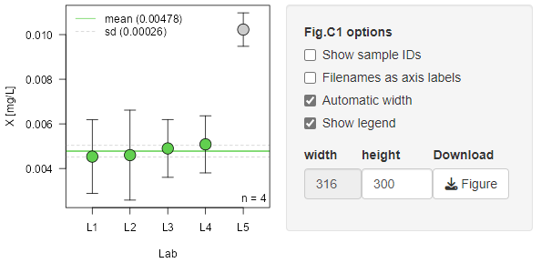

### Certified value calculation and vizualization of the currently selected analyte

Lab means and distribution is depicted in a standard graphic layout which can be exported as vector graphic (PDF) for further editing. Labs which have been identified as outliers above can be excluded from the overall mean calculation. This decision has to be made by the user, *eCerto* will not remove an outlier lab automatically.

