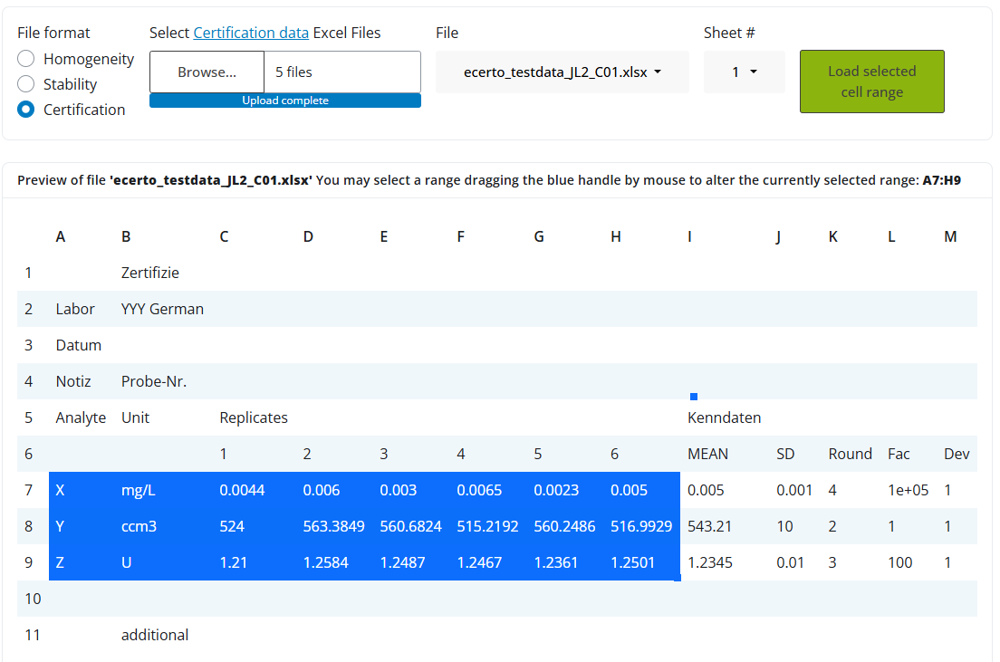

### Certification data upload

To process a new analysis, please collect all data which should be returned in
pre-defined Excel-Files by your certification trial partners and stored within
one folder. Pre-defined means that the analytical results are at the same
position within each file (table name, row and column range) and that exactly
one file per laboratory exists.

This approach resembles a frequent workflow and facilitates to keep the data 
originally send by the partner laboratories *as is*, without the need to combine
them prior to upload, while being able to directly import them into *eCerto* and 
start with the evaluation.

The smallest possible test data file would look like this:

```{r C_upload_example1, echo=FALSE, message=FALSE}
x <- data.frame("A"="X","B"="mg","C"=1.03,"D"=0.98,"E"=1.07)
ft <- eCerto:::show_upload_example_table(x=x, continued = FALSE)
flextable::set_caption(ft, caption = flextable::as_paragraph(
  flextable::as_b("Info"), " Minimum input file"))
```

It contains data for a single analyte **X**, measured in unit **mg** with three
replicate values. You would need at least one more file, preferably with 
different values for **X**, to be able to start an upload. Replicate 
measurements and a sufficient number of partner labs are required to perform the 
statistical tests implemented in *eCerto*.

In reality, the analyte data will be just a part of the table returned by the
partner laboratories, which is why *eCerto* allows you to select a specific cell
range in a preview window as described below.

***Note!*** 
Please select the range without a header as shown in the figure below. *eCerto*
assumes the first and second column of the specified range to contain analyte 
names and units respectively and replicate measurements of this analyte in all 
remaining columns.



File names will be stored for reference but imported labs will be consecutively 
numbered. In the example above you would import data from sheet 1 of each Excel 
file located in Range A7:H9, containing 6 replicate measurements of 3 different 
analytes (column A) measured in units as specified in column B.

*eCerto* can deal with missing values (empty replicates for specific analytes)
and also with some partner labs not providing any data for particular analytes
at all. However, ensure that the cell range is identical in all imported files.
Preferably, you provide a template file for partner laboratories where only
cells intended for measurement values can be edited while other cells are write 
protected.

***Note!*** 
Currently, *eCerto* needs to load all Excel result files in one step, *i.e.* you 
can not add additional files later on but would have to start all over again.
However, this is reasonable as statistics will change upon addition of new values 
which in turn might require adjustments in rounding precision or filtered labs.
