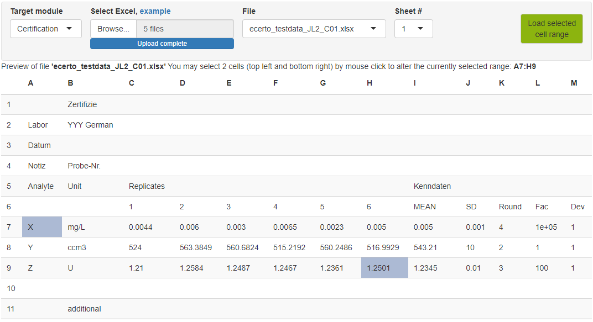

### Certification data upload (Excel)

To process a new analysis, please collect all data which should be retuned in
pre-defined Excel-Files by your certification trial partners and stored within
one folder. Pre-defined means that the analytical results are at the same
position within each file (table name, row and column range) and that one file
per laboratory exists.

***Note!*** 
Please select the range without a header. *eCerto* assumes the first and second 
column to contain analyte names and units respectively and replicate measurements 
of this analyte in all remaining columns.

Filenames will be stored for reference but imported labs will be consecutively 
numbered. In the example above you should import data from sheet 1 of each Excel 
file located in Range A7:H9, containing 6 replicate measurements of 3 different 
analytes measured in units as specified in column B.

***Note!*** 
Currently, *eCerto* needs to load all Excel-result files in one step,
i.e. you can not add additional files later on but would have to start all over
again.
