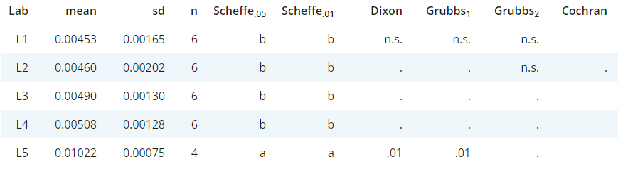

### Laboratory statistics to identify potentially outliers for lab means and lab variances

For the selected analyte various statistical tests regarding lab means and variance will be performed according to ISO 17025 
and outlying values will be indicated if observed at the **.05** and **.01** level respectively. 
`n.s.` and `.` indicate either that the test probability was >0.05 or that this lab was not tested.

Except for `Cochran`, which tests for outliers with respect to variance, all other columns indicate potential outliers regarding lab means.

To compute the statistical tests *eCerto* uses functions from different packages available for **R**. 
Details regarding the conducted statistical test (implementation, parameters) can be found using the following links:
  
* <a href="https://rdrr.io/cran/agricolae/man/scheffe.test.html" target="_blank" rel="noopener noreferrer">Scheffe</a> 
***Note!*** Similar letters indicate similar group and hence no difference. The test is performed at two $\alpha$ levels (.01 and .05).
* <a href="https://rdrr.io/cran/outliers/man/dixon.test.html" target="_blank" rel="noopener noreferrer">Dixon</a>
* <a href="https://rdrr.io/cran/outliers/man/grubbs.test.html" target="_blank" rel="noopener noreferrer">Grubbs</a>
***Note!*** Test is performed as single (only the most extreme value at each end of the distribution is tested) 
as well as double version (the two most extreme values are tested against the rest).
* <a href="http://www.statistics4u.info/fundstat_germ/ee_nalimov_outliertest.html" target="_blank" rel="noopener noreferrer">Nalimov</a>
* <a href="https://rdrr.io/cran/outliers/man/cochran.test.html" target="_blank" rel="noopener noreferrer">Cochran</a> 
***Note!*** This test is performed consecutively, *i.e.* the Lab showing the highest variance is tested first. 
If significant, it is removed and the procedure is repeated. 
`excl` indicates that the `sd` of a lab was too low and the lab was removed from the testing procedure.

***Note!***
Most tests require at least 3 data points (Labs) and finite differences in Lab means and Lab variance.
If these conditions are not be fulfilled `Error` might be reported instead of a P-value.
