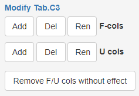

### Editing options

`F` and `U` columns in **Tab.C3** can be added, removed or renamed using the respective parameter 
panel next to the table.

***Note!***
*eCerto* will respect HTML formatting, *i.e.* if you want to use subscript in your column name 
you can use `uhom` as input to create a column with displayed name $u_{hom}$.

Default values are 1 and 0 for `F` and `U` columns respectively, as these are neutral with respect 
to the result. In `F` and `U` columns all values can be edited manually by double clicking the 
respective cell, entering a new value and clicking outside the cell to confirm the modification. 

`U` columns can also be filled automatically with data from the homogeneity and stability modules 
of *eCerto*. 

***Note!***
Manual modifications will be overwritten by any automatic transfer into the same column.

The only other column which can be manually edited is `k`, the expansion factor for `u_com`. All 
other columns can not be modified by the user and will only show a grey background upon double 
click. This is on purpose to ensure a robust workflow and comprehensible statistical results. It 
requires a careful preparation of input data files, e.g. providing reasonable and consistent 
analyte names and units.
