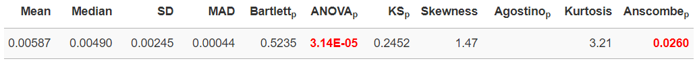

### Statistics on the distribution of lab means

The distribution of lab means is evaluated using a variety of recommended tests. 
Normality of the distribution is tested using the KS-Test. Besides `mean` and `sd` 
the robust alternatives `median` and `MAD`are provided. Columns which end on `_p` 
provide P-values of the respective tests. Skewness and Kurtosis are computed 
additionally and grouped with their respective tests (Agostino and Anscombe).

To compute the statistical tests *eCerto* uses functions from different packages 
available for **R**. Details regarding the conducted statistical test can be found 
using the following links:

* <a href="https://rdrr.io/r/stats/bartlett.test.html" target="_blank" rel="noopener noreferrer">Bartlett</a>
* <a href="https://rdrr.io/r/stats/anova.html" target="_blank" rel="noopener noreferrer">ANOVA</a>
* <a href="https://rdrr.io/r/stats/ks.test.html" target="_blank" rel="noopener noreferrer">KS</a>
* <a href="https://rdrr.io/cran/moments/man/skewness.html" target="_blank" rel="noopener noreferrer">Skewness</a>
* <a href="https://rdrr.io/cran/moments/man/agostino.test.html" target="_blank" rel="noopener noreferrer">Agostino</a>
* <a href="https://rdrr.io/cran/moments/man/kurtosis.html" target="_blank" rel="noopener noreferrer">Kurtosis</a>
* <a href="https://rdrr.io/cran/moments/man/anscombe.test.html" target="_blank" rel="noopener noreferrer">Anscombe</a>

***Note!*** 
Some tests need a minimum number of replicates and will not yield a result if this 
criteria is not met (*i.e.* Agostino).

The `KS test` is used to compare the distribution of Lab means against a normal distribution.
Besides the respective P-value, also a QQ-plot can be opened using the respective link.
