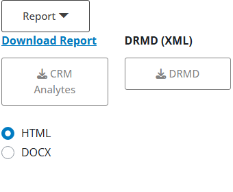

### Analyte and material reports

A report of the current analysis (single analyte) or for the material (**Tab.C3**) 
can be generated and exported in HTML or DOCX format.

Additionally, **Tab.C3** can be exported to Digital Reference Material Document 
(DRMD) format, which is currently under `r eCerto::save_link("development", "https://github.com/janlisec/drmd")`.

---

***Note!***
The current report layouts are for demonstration purpose only. Very likely, we will 
implement a set of recommended report layouts in the future upon user suggestions.

---