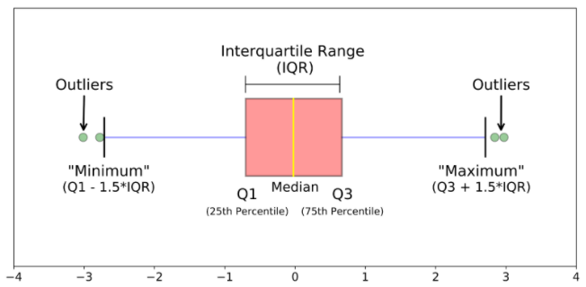

### Homogeneity boxplot

Statistical differences between groups are nicely visualized using boxplots. 
While the ANOVA allows to calculate a probability testing the hypothesis that 
the mean values of different groups are similar or not, the boxplot visualizes 
the distribution of values within each group.

The box comprises 50% of the measured values of a group (from 25% to 75% quartile) 
and highlights the median (50% quartile). Overlapping boxes indicate that a t-test 
would not yield a significant P-value.

Within **Fig.H1** dashed black and grey lines indicate $\mu$ and $s$ of the
distribution of specimen means from **Tab.H2**.

Especially when several analytes are tested in a material using a small number of
replicates per specimen, ANOVA might result in P-values below the alpha-level.
Observing such a P-value does not automatically render the material non homogeneous.
Due to multiple testing such observations might be False Positive results.
However, they require a more careful inspection of the data to identify a potential
systematic bias. To this end, eCerto offers several options:

- apply bonferroni correction to account for multiple testing (if adjusted P-values
are above the alpha level, the material can be considered as homogeneous)
- check z-scores plot of all analytes (to check if there are specimen which deviate 
from the poupulation mean systematically, i.e. in one direction)
- overlay **Fig.H1** with numbers indicating the replicate (to check if for a 
suspicious specimen always the same replicate over all analytes causes a severe
deviation, which might be a reason to exclude this single measurement)
