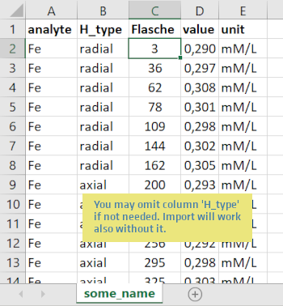

### Homogeneity data upload (Excel)

Please prepare all data in a single Excel file on the first table (other tables will be neglected). 
Please stick to the column order as given in the below example. 

***Note!*** 
You may omit column `H_type` in your Excel input file if not needed.

The `analyte` column has to contain values that match the corresponding data from the certification 
module. `H_type` can be used to define different homogeneity traits for each analyte which can yield 
independent uncertainty contributions. `Flasche` encodes the different samples where repeated 
measurements have been performed on. Each item in `Flasche` should occur several times per analyte
as these are your replicates to be considered in the statistics. `value` has to contain numeric 
values only to allow calculations. `unit` is neither checked nor converted but used for plot 
annotation only.

***Note!*** 
`value` data have to be determined similarly (same `unit`) to the data from the certification trial 
obviously to yield a meaningful uncertainty value.
