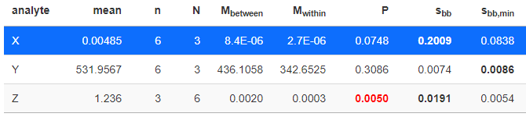

### Homogeneity Uncertainty calculation

We first conduct an analysis of variance (ANOVA) on a one factor linear model for $N$ bottles 
(or containers) with $n$ replicate measurements each. The ANOVA is preformed for each `analyte` 
and `H_type` (if specified during upload) independently. The `P`-value of each ANOVA is provided 
in **Tab.1** together with the variance within bottles $s_w$ (`M_within`) and the variance between 
bottles $s_a$ (`M_between`).

A significant ANOVA P-value indicates inhomogenious specimen and is highlighted in red color in **Tab.1**.

***Note!*** 
To account for the case of different number of replicates over all $N$ bottles, $n$ is calculated 
according to ISO GUIDE 35 as:

$$n=\frac{1}{N-1} \times \left[\sum_{i=1}^N{n_i}-\frac{\sum_{i=1}^N{n_i^2}}{\sum_{i=1}^N{n_i}}\right]$$

where $n_{i}$ is the vector of replicates per group. Together with the overall mean vlaue $\mu$ 
(mean of all $N$ bottle means), we now can compute two relative uncertainties between bottles:

$$s_{bb}=\frac{\sqrt{\frac{s_a-s_w}{n}}}{\mu}$$

and

$$s_{bb, min}=\frac{ \sqrt{ \frac{s_w}{n} } \times \sqrt[4]{ \frac{2}{N \times (n-1)} }}{\mu}$$

The larger of both values, $s_{bb}$ and $s_{bb,min}$, is selected as uncertainty contribution 
when the user decides to transfer an uncertainty value to the material table. The larger of both values
is rendered in bold font.

A transfer is only possible for analytes which have been found in the table of certified values
(**Tab.3** in the C modul). Analytes not present there will be rendered in red.

***Note!*** 
When $s_{a} < s{_w}$ we set $s_{bb}=0$.