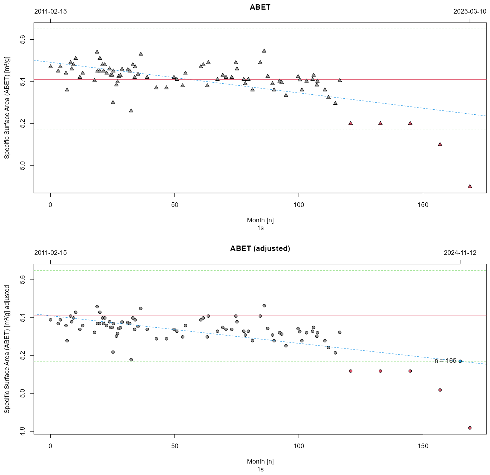

### LTS statistics

The Tool calculates the expected life time of a reference material in several steps:

1. calculating a linear model for the measurement data $y = m \times x+n$, where $y$ represents
measured values and $x$ represents time (expressed in month)
2. correcting the intercept $n$ for the difference between the mean obtained from LTS data and 
the mean reported as certified value on import $n' = n + \mu_\mathit{LTS} - \mu_c$
3. using the corrected $n'$ and $m$ to estimate the time point when the value of the certified 
analyte is expected to exceed the range of $\mu_c \pm U$

The calculation results are depicted in **Fig.L1** and can be exported as a report in PDF format.