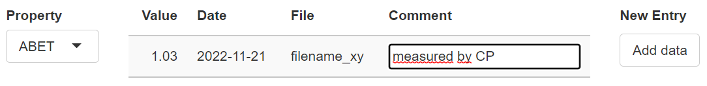

### Data entry for LTS data

After data upload, the user can add new data points for a selected property by manually
editing the 4 fields in the input area and clicking on the button `Add data`.

Comments to a data point are optional. To prevent non-deliberate modification of measurement
data, only comments can be changed by the user after data upload. Comment modification can 
be conviniently performed by selecting a data point, either in **Tab.L1** or in **Fig.L1**,
entering a new text in the `comment` input field and confirming the modification by clicking
the button `Add comment`.
