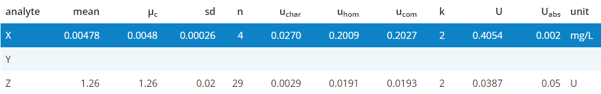

## Table of certified values

The table of certified values (**Tab.3**) combines all data collected within a certification trial to provide for each 
measured entity within the certified material the certified mean $\mu_c$ (`cert_val`) and the certified uncertainty `U`.

***Note!*** 
Only for analytes which have been visually inspected by the user certified values will be transfered to this table
to ensure that inspection took place. The reported `mean` is similar to the value obtained in **Fig.1** but will be 
different to **Tab.2** when Labs are filtered for an analyte.

Several columns of the material table can be edited by the user by clicking in an individual cell and entering a new value.

Table column descriptions:

-   `mean` and `sd` give the arithmetric mean $\mu$ and standard deviation $s$ for `n` analytical values of this analyte 
    similar to **Fig.1**
-   `n` is dependent on `pooling` and gives the number of values used for calculting $\mu$ and $s$.
    To this end, `n` is either similar to the number of finite measurement values (`pooling` allowed)
    or similar to the number of labs included in the analysis (`pooling`not allowed).

    *Example*: We have an arbitrary analyte measured in three laboratories with five replicates each. 
    We can calculate $\mu$ from all three laboratory averages (`pooling`not allowed, `n=3`). 
    If a laboratory is filtered, it will be grayed-out in the plot and not considered for $\mu$ (`n=2`). 
    If the user decides to allow `pooling` than `n` will reflect the number of finite measurement values from 
    all labs for this analyte (`n = 2 x 5 = 10`).
-   `F` columns can be added/edited and may contain correction factors $f_i$ to adjust $\mu$ and obtain 
    the certified mean `cert_val` by $\mu_c = \mu \times \prod f_i$
-   `U` columns can be added and may contain relative uncertainty contributions 
    (e.g. from homogeneity or stability modules)

    ***Note!*** 
    `U` columns containing different uncertainty contributions should always be provided relative to the mean to allow an 
    easy combination of the individual terms. Only `U_abs` is expressed as an absolute value.

-   `u_char` describes the *char*acteristic uncertainty, calculated as $u_{char}=\frac{s}{\sqrt{n} \times mean}$
-   `u_com` is the *com*bined uncertainty from all U columns, where all relative uncertainty components $u_i$ 
    are combined using formula $u_{com}=\sqrt{\sum{u_i^2}}$
-   `k` is an additional expansion factor for the uncertainty $U=u_{com} \times k$
-   `U_abs` specifies the absolute uncertainty and is calculated by $U_{abs}=U \times \mu_c$

**Tab.3** can be exported together with a report as PDF, Word or HTML document using the download section on top of the page.

`F` and `U` columns can be added, removed or renamed using the respective parameter panel next to the table.

***Note!*** 
Numeric values are rounded to the number of digits specified by the user at the analyte selection panel (top, `Precision (cert)`).
However, all relative `U` columns are depicted with fixed 4 digits precision.
