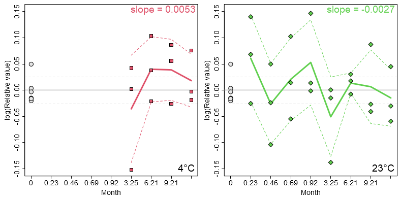

#### Determining temperature-dependent reaction rates

The analyte values measured at $T_{min}$ are considered as stable and their mean is used as 
reference time point \($t=0$\) for each temperature level $T_i$. When measured values are depicted 
relative to this mean, *eCerto* calculates and annotates the recovery and RSD for each $T_i$.

When the above ratios are log-transformed and the x-axis (time) is set to month, *eCerto* 
calculates the temperature-dependent reaction rates $k_{\mathit{eff}}(T)$ as the slope for each 
linear model of $T_i$.

