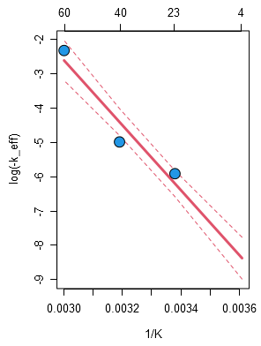

#### Arrhenius model for analyte stability

The model parameters calculated in **Tab.S2** are visualized in **Fig.S3** plotting the log transformed
negative $k_{\mathit{eff}}(T)$ over the inverse temperature [1/K].

The axis at the top of **Fig.S3** indicates the corresponding temperature level for each data point in °C.
