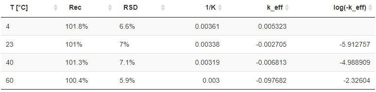

#### Calculation of possible storage time

Besides `Rec`overy and `RSD` for each temperature level $T_i$ (`T [°C]`), the slope `k_eff` and 
the log-transformation of it's negative value `log(-k_eff)` are provided in **Tab.S2**.

In the case that at least 3 finite values for $log(-k_{\mathit{eff}})$ exist, a linear model over 
`1/K` is calculated (depicted in **Fig.S3**). Based on slope $m$ and intercept $n$ of this model values 
$K_i$ (provided in `log(k)_calc`) are established using $K_i = m \times x_i + n$.

To estimate the confidence interval of the model (`CI_upper` and `CI_lower`) we need to estimate 
some intermediate values provided in the bottom table. Here, *eCerto* calculates $a=\sum{x_i}$, $b=\sum{x_i^2}$ 
and $n=length(x_i)$ where $x_i=1/K$ together with the standard error $err$ for this model:

$$err=\sqrt{\frac{1}{n-2} \times \sum{(y_i-\overline{y})^2} - \frac{\sum{(x_i-\overline{x}) \times (y_i-\overline{y})}^2}{\sum{(x_i-\overline{x})^2}}}$$

Next, these four values $a$, $b$, $n$ and $err$ allow to compute the dependent variables:

$$u(i) = \sqrt{\frac{err^2 \times b}{(b \times n-a^2)}}$$

$$u(s) = \sqrt{\frac{err^2 \times n}{(b \times n-a^2)}}$$

$$cov = -1 \times \frac{err^2 \times a}{(b \times n-a^2)}$$

which, finally, can be used to estimate the confidence interval $CI$ as:

$$CI_{(upper,~lower)} = K_i \pm \sqrt{ u(i)^2 + u(s)^2 \times x_i^2 + 2x_i \times cov }$$

When a certified value $\mu_c$ and corresponding uncertainty $U_{abs}$ (`cert_val` and `U_abs`) are available 
for an analyte in **Tab.C3** of the certification module of *eCerto*, these can be used together with $CI_{upper}$ 
to calculate the storage time $S_{Month}$ for each evaluated temperature level using:

$$S_{\mathit{Month}}(T) = \frac{ \log( \frac{\mu_c - U_{abs}}{\mu_c})}{e^{CI_{upper}(T)} }$$

***Note!***
Extrapolation beyond the range of storage conditions tested (for example, predicting degradation rates 
at −20 °C from an experiment involving only temperatures above 0 °C) can be unreliable and is not recommended.