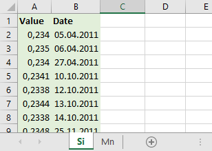
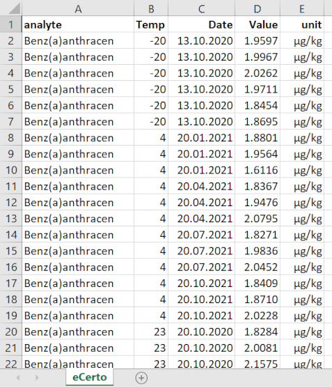

### Stability data upload (Excel)

Please prepare data in a single Excel file on separate tables for each analyte as shown 
in the below example.

Table names have to match analyte names from the Certification module to be properly assigned. 
Column names need to be exactly `Value` and `Date` with Excel column formats set to 
*numeric* and *date* respectively.

Stability data can also be uploaded using a more complex data format to allow shelf life 
calculations based on the Arrhenius model. To this end, the user needs to prepare a single 
Excel table including the columns `analyte`, `Temp`, `Date`, `Value` and `unit`.

The `Temp` column obviously should contain temperature levels in °C at which samples were
stored before measurement. The lowest temperature level will be used as a reference point
$T_\mathit{ctrl}$. This is also reflected in the specified `Date` values, where 
$T_\mathit{ctrl}$ will be treated as a reference time point. All other temperature levels
should have later dates specified. For every measurement, the difference between its date
and the reference time point will be computed to represent the storage time at this
temperature.

Using dates instead of specifying storage time directly allows to compute stability and
potential shelf life in month and as an absolute date.

***Note!***
Upload can be also achieved from a previously created backup file. If a backup file does not 
contain any stability data, the Excel upload option will remain active (and will become 
deactivated if stability data are contained).
