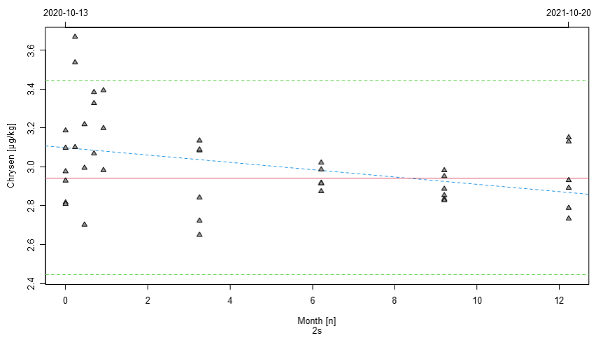

### Stability linear model plot

The uncertainty contribution of the stability measurements `u_stab` is calculated for each analyte
based on a linear model of `Value` on `Date`, or, more precisely, on the monthly difference `mon_diff`
calculated based on the imported `Date` values.

The data and linear model is visualized in **Fig.S1**. Here, in addition to the monthly difference
plotted on the bottom axis, start and end date of the data points are depicted at the top of the plot.
The red line indicates the certified value $\mu_c$ and the two green dashed lines provide either 
the standard deviation $2s$ of the data or $U_{abs}$ from the table of certified values, based on 
availability and user choice.

***Note!*** If no table of certified values is present or the analyte is yet unconfirmed, than red 
and green lines represent mean and standard deviation of the currently depicted stability data.

The dashed blue line indicates the linear model. It's parameter $b_1$ is reported in **Tab.S1** and 
used to calculate `u_stab`.

