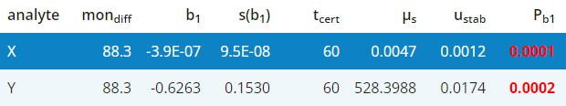

### Stability uncertainty calculation

The parameters of all linear models are collected in **Tab.S1** and the potential
uncertainty contribution of the material stability is obtained from formula 
$u_{stab}=|t_{cert} \times err|$ where $t_{cert}$ is the expected shelf life of
the CRM (in month) and $err$ is the standard error `SE` of the slope of the linear model.

The expected shelf life can be set by the user and should incorporate the time until
the first certification monitoring and the certified shelf life of the material. 
This estimation of stability uncertainty is based on section 8.7.3 of ISO GUIDE 35:2017
and valid in the absence of a significant trend.

To determine if the slope $m$ is significantly different from $m=0$ we perform a t-test by 
calculating the t-statistic $t_m = |m| / s(m)$ and comparing the result with the two-tailed 
critical value of Student's $t$ for n - 2 degrees of freedom to obtain the P-values in column `P`.

***Note!***
Clicking on a table row will display the analysis for the analyte specified in this row.

Values from column `u_stab` can be transfered to the material table of the certification module 
in case that matching analyte names are found (analyte names are depicted in red if not found).
