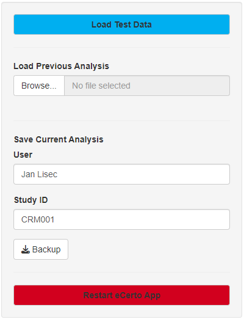

### Purpose of the Tool

*eCerto* is an online tool written in R/Shiny to facilitate the statistical evaluation of data 
collected in connection with the production of certified reference materials (CRMs) at Bundesanstalt für Materialforschung und -prüfung (BAM).

The standard workflow consists of a certification trial in combination with homogeneity and stability assays. 
Data from all of these assays need to be collected, combined and analyzed to report certified values of measured properties or entities of a reference material.

The tool provides some example data to test the functionality on the `Start` page. 
Here, previous analyses can be read from a backup file and will contain all input data and previously set parameters.

A new analysis can be started by importing data from Excel but should be stored after statistical analyes together with your user name and a trial ID as an RData-file data (`Backup`).
