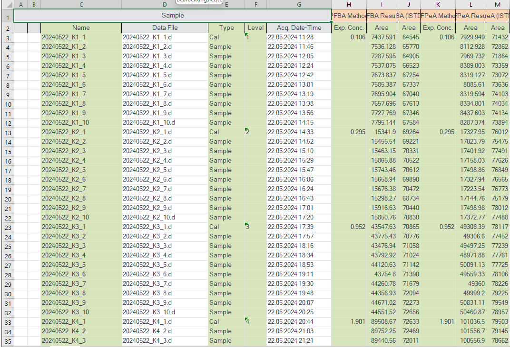

### Data upload

#### Option 1

Please prepare your data in an Excel file with the same format as shown below.

```{r V_upload_format1, echo=FALSE, message=FALSE}
x <- eCerto:::read_Vdata(file = system.file(package = "eCerto", "extdata", "eCerto_Testdata_VModule.xlsx"))[1:23,2:8]
ft <- eCerto:::show_upload_example_table(x=x, max_char = 15, optional = c(1,2))
flextable::set_caption(ft, caption = flextable::as_paragraph(
  flextable::as_b("Info"), " Example table layout for validation data upload"))
```

The optional columns `Name` and `Type` are recommended for later reference. They
will be filled with dummy data if not present. All measurement
values used in calculations will be of Type **Cal**, i.e. originating from a 
calibration sample with a defined concentration for each analyte. The observed
peak area values of analytes and their internal standards (IS) are used to
perform calculations of method validation.

#### Option 2

Alternatively you can provide data in a single Excel file exported by Agilent 
MassHunter Software.



The information in columns `Name` and `Type` are kept for later reference only.
The information on analyte names is extracted from the red area.
The information on calibration levels (similar for all analytes) and according
analyte concentrations within each level (analyte specific) is used as the
independent variable $x$ in all figures and tables.
The information on peak area of each analyte and its respective internal 
standard (IS) is used to calculate the dependent variables $y=f(x)$ in all 
figures and tables.

***Note!***
Empty cells in the columns `Level` and `Exp. Conc.` will be filled with the
closest finite value above, i.e. it is assumed that all samples in rows 4 to 12
in the example are replicates of calibration level 1 (as defined in row 3).

*eCerto* will try to determine the used format upon upload automatically.

#### Option 3

You can store any data imported from Excel together with all specified 
parameters in an RData file. Such an RData file can be loaded similar to one
of the Excel files described above. The advantage in using such an RData file
is that user defined parameters (alpha, k, filters...) are stored together with
the raw data.
