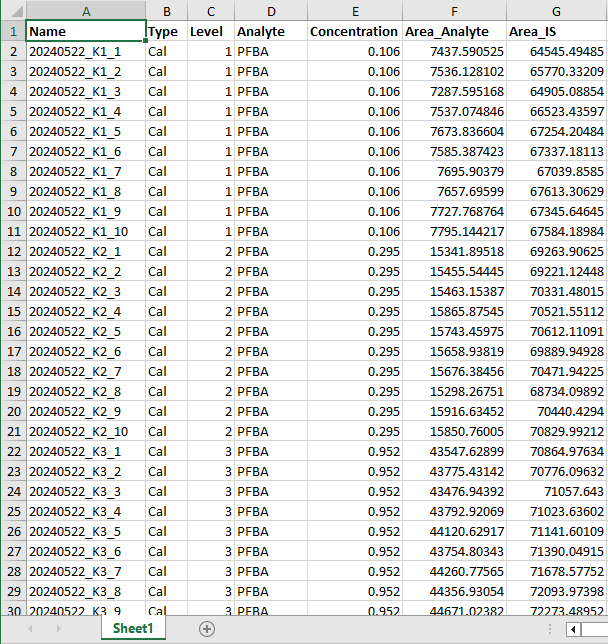

### Data upload

Please prepare data in a single Excel file using the Agilent MassHunter Software.

The information in columns `Name` and `Type` are kept for later reference only.
The information on analyte names is extracted from the red area.
The information on calibration levels (similar for all analytes) and according
analyte concentrations within each level (analyte specific) is used as the
independent variable $x$ in all figures and tables.
The information on peak area of each analyte and its respective internal 
standard (IS) is used as the dependent variable $y=f(x)$ in all figures and tables.

***Note!***
Empty cells in the columns `Level` and `Exp. Conc.` will be filled with the
closest finite value above, i.e. it is assumed that all samples in rows 4 to 12
in the example are replicates of calibration level 1 (as defined in row 3).

Alternatively you can set up your data similar to the following layout.

*eCerto* will try to determine the used format upon upload automatically.