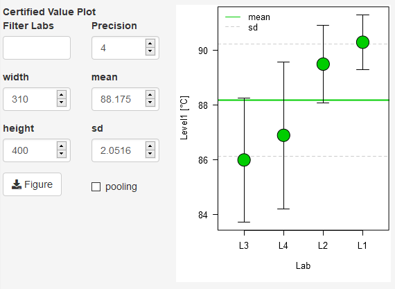

# Certification
### User/Study information and data backup/retrieval
For the eCerto module of the software you should provide a user name and trial
id which will be stored together with your data ('Save Current Analysis').
Previous analyses can be read from a backup file and contain all input data,
parameters set during analysis and results.
### Data upload from Excel for a new analysis
To process a new analysis, please collect all data which should be retuned in
pre-defined Excel-Files by your certification trial partners and stored within
one folder. Pre-defined means that the analytical results are at the same
position within each file (table name, row and column range) and that one file
per laboratory exists.

**Note!** "Header row should be specified but will not be evaluated. eCerto
assumes the first and second column to contain analyte names and units
respectively and replicate measurements of this analyte in all remaining
columns.",

**Note!** Filenames will be stored for reference but imported labs will be
consecutively numbered. In the example below you would import data from table
'Tabelle1' located in Range A1:D5, containing 2 replicate measurements of 4
different analytes measured in &deg;C. Instead of the table name you could as
well provide a number specifying the sheet number in your excel files (in this
case you could input '1' as only one sheet is contained in the file). The Upload
starts once files have been selected via 'Browse'-button.

**Note!** "Currently, eCerto needs to load all Excel-result files in one step,
i.e. you can not add additional files later on but would have to start all over
again.

### Laboratory statistics to identify potentially outliers for lab means and/or
lab variances
For the selected analyte various statistical tests regarding lab means and
variance will be performed according to ISO 17025 and outlying values will be
indicated if observed at the .05 and .01 level respectively.

eCerto uses functions available for the statistical software environment R.
Details regarding the conducted statistical test (implementation, parameters) can be found using the following links:

* [Scheffe](https://rdrr.io/cran/agricolae/man/scheffe.test.html)
* [Dixon](https://rdrr.io/cran/outliers/man/dixon.test.html)
* [Grubbs](https://rdrr.io/cran/outliers/man/grubbs.test.html)
* [Nalimov](http://www.statistics4u.info/fundstat_germ/ee_nalimov_outliertest.html)
* [Cochran](https://rdrr.io/cran/outliers/man/cochran.test.html)

### Statistics on the lab means distribution
The distribution of lab means is evaluated using a variety of recommended tests. Normality is tested using the KS-Test.

**Note!** Some tests need a minimum number of replicates and will not yield a
result if this criteria is not met (i.e. Agostino).

Details regarding the conducted statistical test can be found using the following links:

- [Bartlett](https://rdrr.io/cran/stats/man/bartlett.test.html)
- [ANOVA](https://rdrr.io/cran/stats/man/anova.html)
- [KS](https://rdrr.io/cran/stats/man/ks.test.html)
- [Skewness](https://rdrr.io/cran/moments/man/skewness.html)
- [Agostino](https://rdrr.io/cran/moments/man/agostino.test.html)
- [Kurtosis](https://rdrr.io/cran/moments/man/kurtosis.html)
- [Anscombe](https://rdrr.io/cran/moments/man/anscombe.test.html)

### Certified value calculation and vizualization of the currently selected analyte

Lab means and distribution is depicted in a standard graphic layout which can be exported as vector graphic (PDF) for further editing. Labs which have been identified as outliers above can be excluded from the overall mean calculation. This decision has to be made by the user, eCerto will not remove an outlier lab automatically.

### Export Reports of the currently selected analyte or the certified values of all analytes
A report of the above analysis (single analyte) or for the material (all analytes) can be generated and exported in different formats.

Certified values for each analyte (following individual inspection) are transfered to a table for the material. Several columns of this table can be edited by the user by clicking in an individual cell and changing the value.

**Note!** While certified values could be calculated directly after data upload this is only done on a per analyte basis to enforce manual inspection of the data by the user. 

However, this is not yet the final state and just a technical demonstration [ToDo]