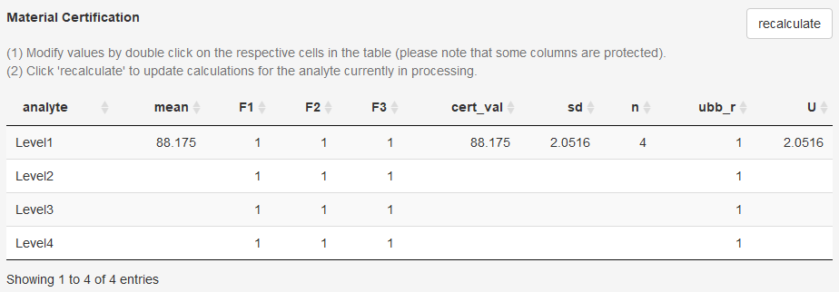

## Certification

### User/Study information and data backup/retrieval
For the eCerto module of the software you should provide a user name and trial
id which will be stored together with your data ('Save Current Analysis').
Previous analyses can be read from a backup file and contain all input data,
parameters set during analysis and results.

```{r child = 'certification_dataupload.Rmd'}
```

```{r child = 'certification_laboratoryStatistics.Rmd'}
```

```{r child = 'certification_meanDistribution.Rmd'}
```


```{r child = 'certification_boxplot.Rmd'}
```

### Export Reports of the currently selected analyte or the certified values of all analytes
A report of the above analysis (single analyte) or for the material (all analytes) can be generated and exported in different formats.

Certified values for each analyte (following individual inspection) are transfered to a table for the material. Several columns of this table can be edited by the user by clicking in an individual cell and changing the value.

**Note!** While certified values could be calculated directly after data upload this is only done on a per analyte basis to enforce manual inspection of the data by the user. 



However, this is not yet the final state and just a technical demonstration [ToDo]