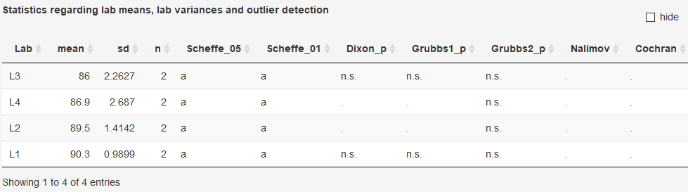

### Laboratory statistics to identify potentially outliers for lab means and/or
lab variances
For the selected analyte various statistical tests regarding lab means and
variance will be performed according to ISO 17025 and outlying values will be
indicated if observed at the .05 and .01 level respectively.

eCerto uses functions available for the statistical software environment R.
Details regarding the conducted statistical test (implementation, parameters) can be found using the following links:
  
  * [Scheffe](https://rdrr.io/cran/agricolae/man/scheffe.test.html)
* [Dixon](https://rdrr.io/cran/outliers/man/dixon.test.html)
* [Grubbs](https://rdrr.io/cran/outliers/man/grubbs.test.html)
* [Nalimov](http://www.statistics4u.info/fundstat_germ/ee_nalimov_outliertest.html)
* [Cochran](https://rdrr.io/cran/outliers/man/cochran.test.html)