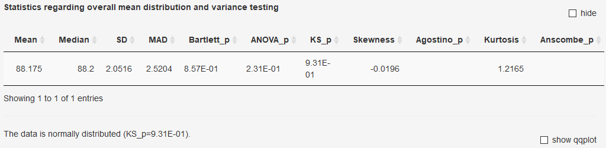

### Statistics on the lab means distribution
The distribution of lab means is evaluated using a variety of recommended tests. Normality is tested using the KS-Test.

**Note!** Some tests need a minimum number of replicates and will not yield a
result if this criteria is not met (i.e. Agostino).

Details regarding the conducted statistical test can be found using the following links:
  
- [Bartlett](https://rdrr.io/cran/stats/man/bartlett.test.html)
- [ANOVA](https://rdrr.io/cran/stats/man/anova.html)
- [KS](https://rdrr.io/cran/stats/man/ks.test.html)
- [Skewness](https://rdrr.io/cran/moments/man/skewness.html)
- [Agostino](https://rdrr.io/cran/moments/man/agostino.test.html)
- [Kurtosis](https://rdrr.io/cran/moments/man/kurtosis.html)
- [Anscombe](https://rdrr.io/cran/moments/man/anscombe.test.html)