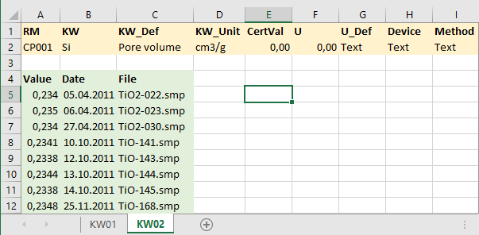

### Data Upload

Please prepare data in a single Excel file on seperate tables for each measured value (KW, Kennwert) as shown in the below example. Table/File names are not evaluated. Instead, each table is expected to contain the metadata in rows 1-2 and the measurement data from row 4 onwards. Column names need to be exactly as in the example and should match the desired format (e.g. 'Value' and 'Date' columns should be of numeric and date format respectively).

